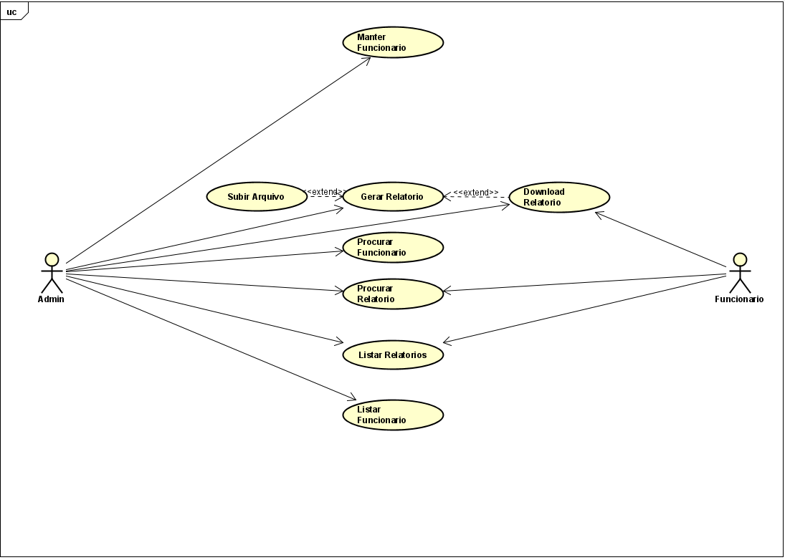
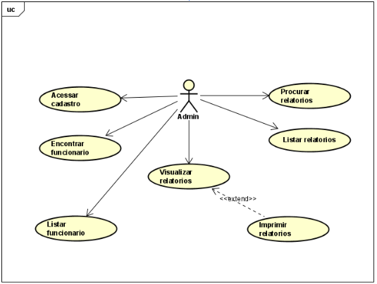
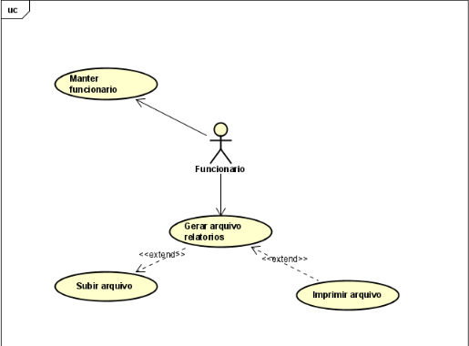

## Projeto Cadastro de funcionario

**Objetivo**

* O objetivo deste projeto é criar um sistema de cadastro de funcionarios, onde o usuário poderá cadastrar, editar, excluir e visualizar os funcionarios cadastrados.
* Além de ter um sistema de login e senha para que somente o usuário possa ter acesso ao sistema.
* E ter um sistema de busca para que o usuário possa buscar os funcionarios cadastrados.
* Calculo de salario liquido com a adição de descontos de impostos
* E gerar a planilha excel com os valores calculados do salario
* Subir dados por meio de excel
* E assinatura digital do funcionario

**Requisitos**
- [x] Criar um projeto no GitHub
- [x] Criar um esteira de integração contínua
- [x] Criar camada de domino
- [x] Criar TDD
- [ ] Criar uma API REST
- [ ] Criar um banco de dados
- [ ] Criar um autenticação
- [ ] Criar um front-end


**Tecnologias**
- [x] Java
- [ ] Spring Boot
- [ ] Spring Data
- [ ] Spring Security
- [ ] Banco de dados em aberto
- [x] GitActions
- [ ] Vuejs
- [ ] Quasar
- [ ] Docker
- [ ] K8S
- [ ] ARGOCD
- [ ] GRAFANA

**Princípios para projeto de software**
- [x] SOLID
- [x] Clean Code
- [x] Clean Architecture
- [x] DDD
- [x] TDD
- [x] POO

- SOLID
````
S - Single Responsability Principle
O - Open Closed Principle
L - Liskov Substitution Principle
I - Interface Segregation Principle
D - Dependency Inversion Principle
````

- Clean Code
````
- Nomes significativos
- Funções pequenas
- Comentários
- Indentação
- Espaços em branco
- Formatação
- Estrutura de código
- Objetos e estrutura de dados
- Tratamento de erros
- Testes
````
- Clean Architecture
````
- Camadas
- Injeção de dependência
- Testes
- Convenções
- Padrões
````

- DDD
````
- Domínio
- Aplicação
- Infraestrutura
- Testes
````


*Obs
````
 Devo usar Singleton ou Static ?

Sendo extremamente rigoroso quanto ao paradigma da orientação a objetos, você deve evitar usar métodos estáticos (função procedural) e também evitar o padrão Singleton (variável/classe global, anti-padrão) pois ambos ferem um dos pilares da OOP que é o encapsulamento.
````

# Caso de Uso






